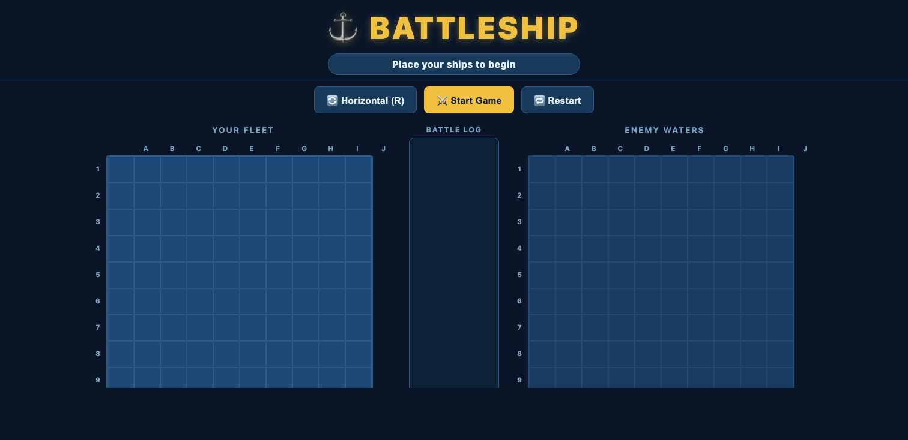

# ⚓ Battleship

A fully-featured, browser-based Battleship game built with **pure vanilla JavaScript, HTML, and CSS** — no frameworks, no build tools, no dependencies.

🎮 **[Play the live demo](https://battleshipgame-am.netlify.app/)**



---

## Features

### 🤖 Smart Computer AI
- **Hunt phase** — fires on a checkerboard pattern `(row + col) % 2 === 0`, halving the search space since every ship of size ≥ 2 always covers at least one even-parity cell.
- **Target phase** — on a hit, queues all four orthogonal neighbours and switches to targeted fire.
- **Direction lock** — after two consecutive hits, locks the firing axis (horizontal or vertical) and concentrates shots along that line in both directions until the ship sinks.
- **Miss pruning** — trims the queue when a shot passes the end of a ship, avoiding wasted shots.
- **Sink detection** — resets targeting state cleanly when a ship is sunk; any remaining queued cells (from a nearby undetected ship) are preserved.

### 🚢 Ship Placement
- Click a ship in the dock to select it, then click your grid to place it.
- Press **R** (or click the Rotate button) to toggle horizontal / vertical orientation.
- Live **green / red preview** shows valid and invalid placements before you commit.
- Full boundary and overlap validation for both the player and the computer.
- Computer ships are placed with a retry loop (up to 1 000 attempts per ship) and a descriptive error if placement fails.
- Board state is validated after setup and any anomalies are logged to the console.

### 🎯 Game UX
- **Turn indicator** — colour-coded status banner: green for your turn, pulsing red during the computer's turn.
- **Enemy grid lock** — the opponent's grid is non-interactive during the computer's turn and before the game starts.
- **Hit / Miss markers** — 🔥 for hits, ● for misses, 💀 when a ship is fully sunk, each with a CSS pop animation.
- **Sunk announcements** — toast notification when either fleet loses a ship.
- **Game-over overlay** — animated modal with result and a "Play Again" button.
- **Battle log** — scrollable panel showing every shot (newest first), colour-coded by type.
- **Duplicate-click prevention** — already-fired cells are ignored and show `cursor: not-allowed`.

### 🎨 Visual Polish
- Naval / ocean colour theme — deep blues, gold accents, red hits, grey misses.
- Axis labels (A–J columns, 1–10 rows) on both grids.
- Ship legend for both fleets showing remaining and sunk ships.
- Hover highlight (`crosshair` cursor) on valid, unfired enemy cells.
- Computer ship positions are never revealed — only hits and misses are drawn on the enemy grid.
- Fully responsive — boards stack vertically on mobile with scaled-down cells.

---

## Project Structure

```
Battleship/
├── index.html       # Semantic HTML — layout, grids, overlays, placement panel
├── main.js          # All game logic (placement, AI, rendering, game loop)
└── battleship.css   # Naval theme, animations, responsive breakpoints
```

`main.js` is organized into clearly labelled sections:

| Section | Contents |
|---|---|
| `CONSTANTS` | Grid size, ship configs, timing constants |
| `STATE` | Game state, turn flag, ship arrays, guess sets |
| `AI LOGIC` | Hunt/target AI, queue management, axis locking |
| `RENDERING` | DOM grid builder, cell updaters, legend, log |
| `PLACEMENT` | Ship dock, preview highlighting, click handlers |
| `GAME LOOP` | Player/computer turn handlers, win detection |
| `LIFECYCLE` | `startGame`, `restartGame`, `init` |

---

## Running Locally

No install required — just open `index.html` in a browser, or serve the directory:

```bash
# Python (built-in)
python3 -m http.server 3000

# Node (npx)
npx serve . -l 3000
```

Then open [http://localhost:3000](http://localhost:3000).

---

## How to Play

1. **Place your ships** — select each ship from the dock and click your grid to place it. Press **R** to rotate.
2. **Start the game** — click **Start Game** once all five ships are placed.
3. **Fire** — click any cell on the enemy grid to fire. Green banner = your turn.
4. **Sink all five enemy ships** to win. Don't let the computer sink yours first!

### Fleet

| Ship | Size |
|---|---|
| Carrier | 5 |
| Battleship | 4 |
| Cruiser | 3 |
| Submarine | 3 |
| Destroyer | 2 |

---

## License

MIT
